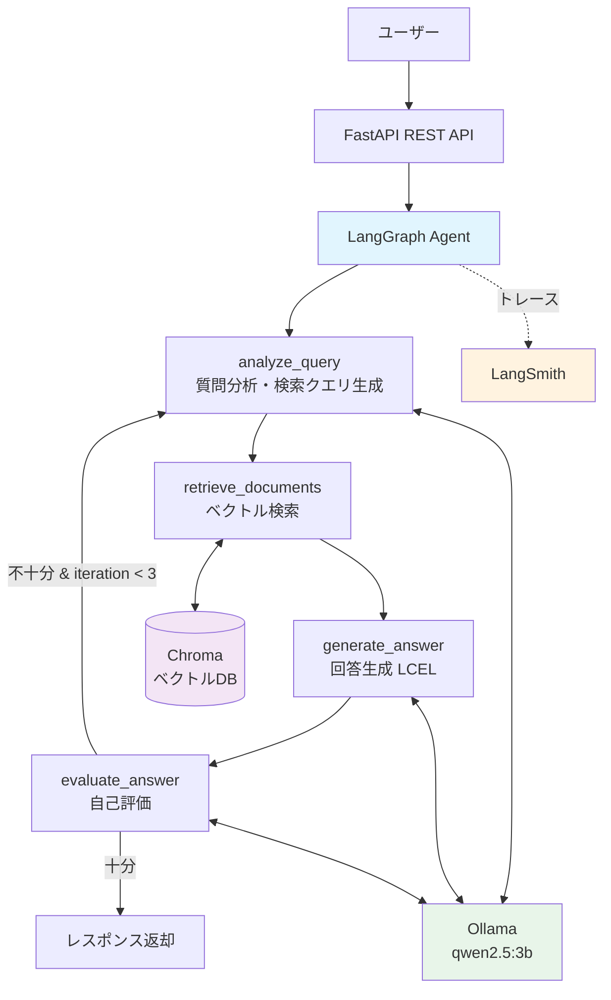

# 技術文書QA RAGエージェント

技術文書を対象としたAI質問応答システムです。
LangChain + LangGraph + Ollamaを使用し、**ベクトル検索 → 回答生成 → 自己評価**のマルチステップエージェントで高品質な回答を生成します。

## デモ

```bash
# 質問を投げる
curl -X POST http://localhost:8000/api/query \
  -H "Content-Type: application/json" \
  -d '{"question": "FastAPIの非同期処理について教えてください"}'
```

```json
{
  "answer": "FastAPIでは、async def を使って非同期エンドポイントを定義できます...",
  "sources": [
    {
      "content": "FastAPIは非同期処理をネイティブにサポートしており...",
      "source": "data/sample_docs/fastapi_guide.md",
      "page": ""
    }
  ],
  "is_sufficient": true,
  "iterations": 1
}
```

## アーキテクチャ



### 処理フロー

1. **analyze_query** — ユーザーの質問から3つの検索クエリを生成（Multi-Query RAG）
2. **retrieve_documents** — Chroma（bge-m3 Embedding）でベクトル類似検索
3. **generate_answer** — 検索結果をコンテキストとして回答を生成（出典付き）
4. **evaluate_answer** — 回答品質をスコアリング（0〜1）し、十分か判定
   - スコア < 0.7 かつ反復 < 3回 → **analyze_query に戻って再検索**
   - スコア >= 0.7 または反復 >= 3回 → **回答を返却**

## 使用技術

| カテゴリ | 技術 | 用途 |
|---------|------|------|
| LLM | Ollama (qwen2.5:3b) | ローカルLLM推論（APIコストゼロ） |
| Embedding | Ollama (bge-m3) | 多言語対応ベクトル化 |
| フレームワーク | LangChain + LCEL | チェーン構成・プロンプト管理 |
| エージェント | LangGraph (StateGraph) | マルチステップワークフロー |
| ベクトルDB | Chroma | ドキュメント保存・類似検索 |
| API | FastAPI | REST APIサーバー |
| 監視 | LangSmith | トレース・実行ログ分析 |
| 設定管理 | pydantic-settings | 型安全な設定・環境変数管理 |
| 言語 | Python 3.12 | 全実装 |

## セットアップ

### 前提条件

- Python 3.10以上
- [Ollama](https://ollama.com/) がインストール済み

### 手順

```bash
# 1. Ollamaモデルのダウンロード
ollama pull qwen2.5:3b
ollama pull bge-m3

# 2. 依存パッケージのインストール
pip install -r requirements.txt

# 3. 環境変数の設定
cp .env.example .env
# .env を編集してLangSmith APIキー等を設定

# 4. ドキュメントの投入（サンプル文書をベクトルDBに登録）
python -m scripts.ingest

# 5. APIサーバーの起動
uvicorn src.api.main:app --reload
```

Swagger UI: http://localhost:8000/docs

## APIエンドポイント

| メソッド | パス | 説明 |
|---------|------|------|
| `POST` | `/api/query` | 質問を受け取りRAGエージェントで回答を生成 |
| `POST` | `/api/upload` | ドキュメント（PDF/Markdown/txt）をアップロードしてベクトルDBに追加 |
| `GET` | `/api/health` | OllamaとベクトルDBの接続状態を確認 |

### リクエスト例

```bash
# 質問応答
curl -X POST http://localhost:8000/api/query \
  -H "Content-Type: application/json" \
  -d '{"question": "LangChainのLCELとは何ですか？", "top_k": 5}'

# ドキュメントアップロード
curl -X POST http://localhost:8000/api/upload \
  -F "file=@my_document.pdf"

# ヘルスチェック
curl http://localhost:8000/api/health
```

## プロジェクト構成

```
src/
├── config/
│   └── settings.py             # pydantic-settingsによる設定管理
├── rag/
│   ├── document_loader.py      # PDF/Markdown読み込み
│   ├── chunker.py              # 日本語対応テキスト分割
│   └── vectorstore.py          # Chroma操作（保存・検索・追加）
├── chains/
│   ├── query_analyzer.py       # 質問→検索クエリ生成チェーン（LCEL）
│   ├── answer_generator.py     # コンテキスト→回答生成チェーン（LCEL）
│   └── evaluator.py            # 回答品質評価チェーン（LCEL）
├── agent/
│   ├── state.py                # RAGAgentState（TypedDict）
│   ├── nodes.py                # 各ノードの処理関数
│   └── graph.py                # StateGraph構築・条件付きエッジ
└── api/
    ├── main.py                 # FastAPIアプリ初期化
    ├── routes.py               # エンドポイント定義
    └── schemas.py              # リクエスト/レスポンススキーマ

scripts/
└── ingest.py                   # サンプル文書のベクトルDB投入スクリプト
data/
└── sample_docs/                # サンプル技術文書（FastAPI, LangChain, Python非同期）
tests/                          # ユニットテスト
docs/implementation/            # 各モジュールの実装手順ドキュメント
```

## 設計上の工夫

### 自己評価ループによる回答品質の担保

LangGraphの条件付きエッジを活用し、回答品質が不十分な場合は自動的に再検索・再回答を行います。最大3回の反復で無限ループを防止しつつ、回答精度を向上させます。

```python
# graph.py より
workflow.add_conditional_edges(
    "evaluate_answer",
    should_retry,
    {"retry": "analyze_query", "end": END},
)
```

### Multi-Query RAGによる検索網羅性の向上

1つの質問から3つの異なる検索クエリを生成し、単一クエリでは拾えない関連ドキュメントも取得します。取得結果は `Annotated[list, operator.add]` により反復ごとに蓄積されます。

### 日本語テキスト分割の最適化

`RecursiveCharacterTextSplitter` に日本語の句読点（。、）をセパレータとして追加し、文の途中で分割されることを防いでいます。

## テスト

```bash
pytest tests/ -v
```

## 参考

- [LangChainとLangGraphによるRAG・AIエージェント[実践]入門](https://gihyo.jp/book/2024/978-4-297-14530-9) — 書籍のパターンを参考にしつつ、Ollama対応・FastAPI化・自己評価ループでオリジナリティを付加
